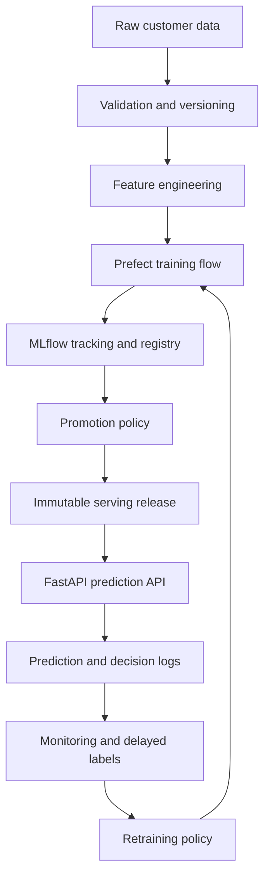
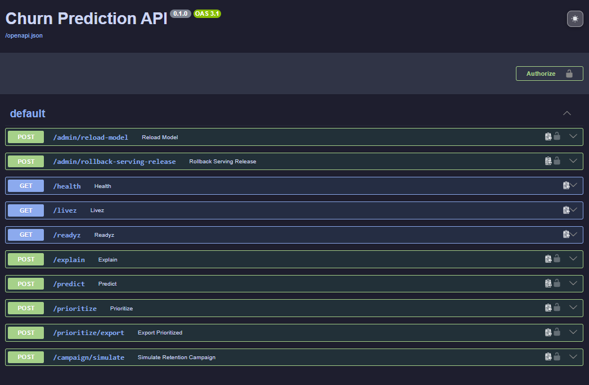
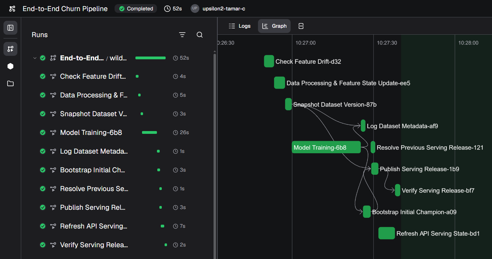
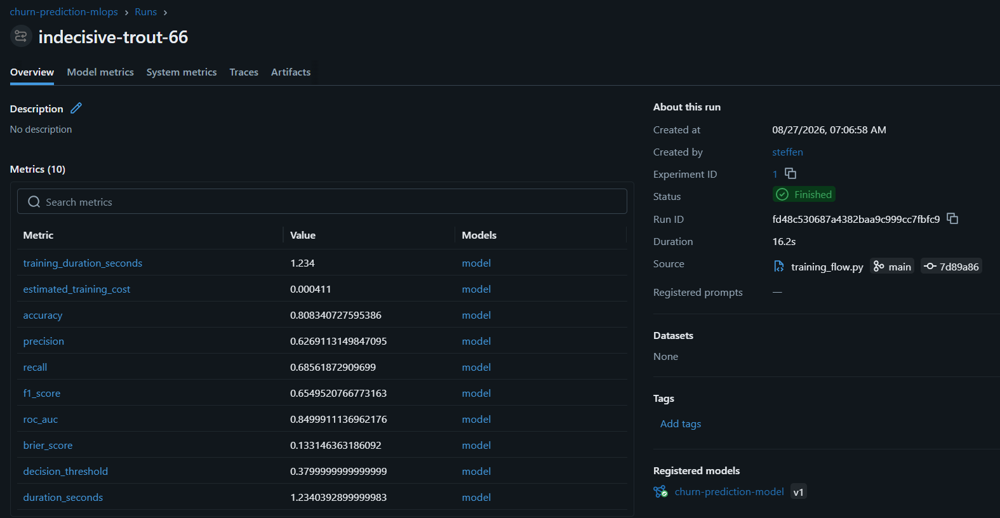
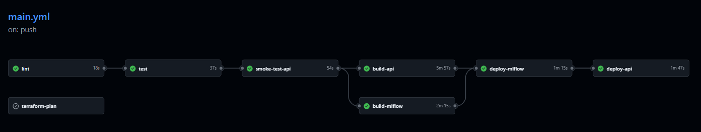

# 🚀 Production-Oriented MLOps Blueprint for Customer Churn Prediction

End-to-end MLOps showcase for deploying, monitoring and continuously improving a customer churn classification system in local and cloud environments.

Customer churn is the example use case. The primary focus is the engineering layer required to operate machine learning reliably after training: reproducible data processing, experiment tracking, controlled model promotion, atomic serving releases, API observability, delayed-label monitoring, guarded retraining, rollback and automated cloud deployment.


---

## 🎯 What This Project Demonstrates

This repository demonstrates a production-oriented ML lifecycle beyond notebook-based modeling:

- validated and versioned datasets
- reproducible feature engineering
- Prefect-based training and retraining orchestration
- MLflow experiment tracking and model registry workflows
- explicit bootstrap of the first production Champion
- Champion/challenger evaluation with classification-specific promotion gates
- immutable serving releases with checksummed manifests
- atomic activation and rollback of complete serving bundles
- FastAPI inference, prioritization and campaign simulation
- prediction logging and delayed-label performance evaluation
- technical and business-oriented monitoring
- Prometheus metrics, Grafana SLO dashboards and Alertmanager notifications
- CI/CD with tests, container builds and vulnerability scanning
- Terraform-managed deployment to Google Cloud Run

The goal is not merely to train a classifier, but to demonstrate how an ML system can be operated, observed and changed safely over time.

---

## 🧩 Blueprint Positioning

This repository is the classification and decisioning variant of a reusable MLOps blueprint.

| Project | Problem Type | Example Use Case | Domain-Specific Components |
|---|---|---|---|
| Customer Churn MLOps | Binary classification | Retention risk prediction | Classification metrics, delayed labels, churn decision policy |
| Sales Forecasting MLOps | Time-series regression | Demand forecasting | Temporal features, forecasting state, regression monitoring |

Both variants share the same operational architecture: validation, feature engineering, orchestration, experiment tracking, model registry, serving releases, API deployment, monitoring, retraining and CI/CD.

---

## 🏗️ Architecture Overview



The serving API does not independently assemble model artifacts at request time. It loads a validated release that binds the model version, feature schema, decision threshold and lineage metadata into one deployable unit.

---

## 📦 Atomic Serving Releases

Every deployable model is represented by an immutable release manifest. A release includes references and checksums for the artifacts required during inference, including:

- registered model name and version
- MLflow run ID and immutable model URI
- model type
- decision threshold
- feature schema
- prediction probe
- dataset version
- configuration hash
- Git commit

The API validates the complete bundle before replacing the active serving state. A failed reload therefore keeps the previous working bundle active.

This prevents partial deployments such as:

- new model with old feature schema
- updated threshold with old model
- missing or corrupted serving artifact
- alias changes during model loading

Serving releases can be inspected and rolled back without rebuilding the API image.

---

## 🔌 API and Decision Service

The FastAPI service supports:

- single and batch churn prediction
- authenticated requests via `X-API-KEY`
- customer IDs in decision responses
- configurable decision thresholds
- customer-value estimation
- expected-value-based retention actions
- customer prioritization
- campaign simulation
- prediction explanations
- structured lineage and timing metadata
- liveness and readiness probes
- Prometheus metrics
- administrative model reload and serving rollback

Example response:

```json
{
  "predictions": [
    {
      "customer_id": "7590-VHVEG",
      "churn_probability": 0.52,
      "customer_value": 358.2,
      "action": "offer_discount",
      "expected_value": 46.08
    }
  ],
  "status": "success",
  "metadata": {
    "model_name": "churn-prediction-model",
    "serving_alias": "champion",
    "release_id": "release-...",
    "model_version": "1"
  }
}
```

<p align="center">
  
</p>

---

## 💰 Business Decision Logic

The API translates probabilities into retention decisions instead of returning only raw model scores.

Each action can incorporate:

- churn probability
- estimated customer value
- intervention cost
- expected uplift
- minimum expected profit
- campaign budget

Example configuration:

```yaml
customer_value: 100
cost_discount: 10
cost_contact: 2
discount_uplift: 0.3
contact_uplift: 0.1
min_expected_profit: 0.0
```

The decision engine supports actions such as `offer_discount`, `send_email` and `no_action`. Batch prioritization selects the most valuable interventions under the configured policy and budget.

---

## 🔁 Training, Evaluation and Promotion

Training and retraining are orchestrated with Prefect. The flow covers:

1. drift and retraining checks
2. raw-data preparation and validation
3. dataset snapshot creation
4. feature engineering
5. model training and MLflow logging
6. classification evaluation
7. Champion/challenger decision
8. serving-release publication
9. API refresh and readiness verification

The first Champion is created explicitly with a bootstrap run. Later forced or monitoring-triggered runs follow the normal promotion policy.

A Challenger is promoted only if it satisfies the configured absolute quality gates and improves sufficiently over the current Champion. This avoids replacing a stable production model with a merely newer model.

<p align="center">
  
</p>

---

## 📊 Experiment Tracking and Lineage

MLflow tracks parameters, metrics, artifacts and model lineage. Classification metrics include, where applicable:

- accuracy
- precision
- recall
- F1 score
- ROC AUC
- Brier score
- decision threshold
- business-value metrics

Dataset versions, configuration hashes and Git commits connect each registered model and serving release to the code and data used to create it.

<p align="center">
  
</p>

<p align="center">
  
</p>

---

## 📈 Monitoring and Observability

The monitoring layer combines ML, business and service-level signals.

### ML monitoring

- runtime data-quality checks
- feature-distribution drift
- delayed ground-truth ingestion
- rolling classification performance
- Champion degradation detection
- retraining eligibility and cooldown state

### Business monitoring

- churn-risk distribution
- selected retention actions
- customer value
- expected campaign value
- campaign cost and budget use

### API and SLO monitoring

- serving readiness
- request throughput
- p50, p95 and p99 latency
- HTTP 5xx rate
- service availability

Prometheus evaluates alert rules for API availability, serving-bundle readiness, prediction latency and server-error rate. Alertmanager forwards notifications to the internal receiver, which can optionally deliver them to Slack.

<p align="center">
  
</p>

<p align="center">
  
</p>

<p align="center">
  
</p>

---

## 🕒 Delayed Labels and Guarded Retraining

Predictions are available immediately, while actual churn outcomes may only arrive later. The demo lifecycle reproduces this operational constraint by:

- logging predictions at inference time
- retaining pending outcomes
- releasing labels after a configured delay
- joining outcomes with previous predictions
- recomputing performance history
- evaluating retraining signals

Retraining safeguards include:

- minimum labeled sample count
- evaluation over recent windows
- persistent degradation signals
- cooldown after retraining
- drift-aware execution
- Champion/challenger promotion gates

Typical policy thresholds include minimum F1, recall and ROC AUC as well as a maximum Brier score. The exact values are configuration-driven.

---

## 🚀 CI/CD and Cloud Deployment

GitHub Actions validates and deploys the project on pushes to `main`.

The pipeline includes:

- Ruff linting
- unit and integration tests
- API smoke tests
- Terraform validation and planning
- API and MLflow image builds
- Trivy vulnerability scanning
- Artifact Registry publishing
- Cloud Run deployment
- Workload Identity Federation authentication

The API image is deployed with an immutable Git SHA tag. Infrastructure is managed through Terraform.

<p align="center">
  
</p>

---

## 🔒 Security and Reliability

- API-key-protected inference endpoints
- non-root application containers
- Workload Identity Federation instead of static CI credentials
- container vulnerability scans
- immutable container tags
- health and readiness probes
- checksummed serving artifacts
- transactional serving-state replacement
- rollback to a previous validated release
- configuration separation between local and production environments

---

## ☁️ Technology Stack

### ML and application

- Python 3.12
- pandas
- scikit-learn and XGBoost
- FastAPI and Uvicorn
- MLflow
- Prefect
- Pandera

### Platform and operations

- Docker and Docker Compose
- PostgreSQL
- Prometheus
- Grafana
- Alertmanager
- Streamlit
- GitHub Actions
- Trivy
- Terraform
- Google Cloud Run
- Google Artifact Registry
- Google Cloud Storage

---

## 📁 Project Structure

```text
.
├── configs/                 # environment, training and monitoring configuration
├── data/                    # local raw and generated lifecycle data
├── docs/                    # architecture and operating documentation
├── flows/                   # Prefect flows and reusable tasks
├── infrastructure/          # Terraform configuration
├── monitoring/              # Prometheus, Alertmanager and Grafana configuration
├── scripts/                 # demos, verification and operational helpers
├── src/
│   ├── api/                 # FastAPI contracts and endpoints
│   ├── data/                # validation, features and versioning
│   ├── deployment/          # cloud deployment helpers
│   ├── inference/           # model loading, decisions and serving releases
│   ├── monitoring/          # ML, business and service monitoring
│   ├── storage/             # filesystem and cloud storage abstractions
│   └── training/            # training, evaluation and registration
├── tests/                   # unit and integration tests
├── docker-compose.yml
├── Makefile
└── pyproject.toml
```

---

## ⚡ Local Quick Start

### 1. Clone and configure

```bash
git clone https://github.com/SL14-SL/mlops-churn-prediction.git
cd mlops-churn-prediction
cp .env.example .env
```

Set at least a local `API_KEY` in `.env`.

### 2. Create the environment

```bash
make setup
source .venv/bin/activate
```

### 3. Start local services

```bash
make dev-up
make wait-prefect
```

### 4. Bootstrap the first local Champion

Use the bootstrap target only when the local MLflow registry is empty:

```bash
make train-bootstrap
```

For later forced training runs:

```bash
make train-force
```

### 5. Verify local serving

```bash
curl -fsS http://localhost:8000/livez | jq .
curl -fsS http://localhost:8000/readyz | jq .
make predict-test
```

### 6. Run quality checks

```bash
make lint
make test
docker compose config --quiet
```

### 7. Register local Prefect automation

```bash
make prefect-pool
make prefect-setup
make prefect-worker
```

Local Prefect uses `http://localhost:4200/api`. Production flow targets use the Prefect Cloud URL and API key from `.env`; the two configurations are intentionally separated.

---

## 🧪 Churn Lifecycle Demo

After the local stack and initial Champion are available:

```bash
make demo-churn-lifecycle
```

The demo simulates prediction batches, delayed labels, monitoring refreshes and retraining decisions.

---

## ☁️ Production Bootstrap and Verification

Production infrastructure is provisioned with Terraform:

```bash
terraform -chdir=infrastructure init
terraform -chdir=infrastructure fmt -check
terraform -chdir=infrastructure validate
terraform -chdir=infrastructure plan
terraform -chdir=infrastructure apply
```

Required production values are loaded from `.env`, GitHub Variables and GitHub Secrets. Validate the non-secret configuration locally:

```bash
make debug-prod-env
make check-prod-env
```

For an empty production registry:

```bash
make train-bootstrap-prod
```

For later forced production training:

```bash
make train-force-prod
```

Verify the deployed API:

```bash
make predict-test-prod
```

Or inspect the probes directly:

```bash
API_URL="$(terraform -chdir=infrastructure output -raw prediction_api_url)"

curl -fsS "$API_URL/livez" | jq .
curl -fsS "$API_URL/readyz" | jq .
curl -fsS "$API_URL/health" | jq .
```

`train-bootstrap-prod` is intended only for a fresh production registry. Once a Champion exists, use the normal production training path.

---

## 📈 Main API Endpoints

| Method | Path | Purpose |
|---|---|---|
| `GET` | `/livez` | Process liveness |
| `GET` | `/readyz` | Complete serving-bundle readiness and lineage |
| `GET` | `/health` | Service and active model status |
| `GET` | `/metrics` | Prometheus metrics |
| `POST` | `/predict` | Churn prediction and retention decision |
| `POST` | `/prioritize` | Rank customers by decision value |
| `POST` | `/prioritize/export` | Export prioritized customers |
| `POST` | `/campaign/simulate` | Simulate retention campaign impact |
| `POST` | `/explain` | Explain an individual prediction |
| `POST` | `/admin/reload-model` | Reload active serving state |
| `POST` | `/admin/rollback-serving-release` | Activate a previous serving release |

Interactive OpenAPI documentation is available under `/docs`.

---

## 🔧 Configuration

The platform uses environment-specific and domain-specific configuration files, including:

- `configs/dev.yaml`
- `configs/staging.yaml`
- `configs/prod.yaml`
- `configs/gcp.yaml`
- `configs/training.yaml`
- monitoring and decision-policy configuration

Runtime environment selection:

```bash
APP_ENV=dev
APP_ENV=prod
```

Secrets such as `API_KEY`, `PREFECT_API_KEY` and optional Slack webhooks must not be committed.

---

## 📦 Dataset

The project uses the Telco Customer Churn dataset as a realistic binary-classification example. The dataset is a vehicle for demonstrating reusable MLOps patterns rather than the central deliverable.

The architecture can be adapted to other supervised decisioning systems such as:

- lead scoring
- conversion prediction
- subscription cancellation prediction
- upsell propensity
- fraud or risk scoring
- support escalation prediction

---

## ⚠️ Scope and Limitations

This repository is a production-oriented portfolio blueprint, not a fully managed enterprise platform.

For a regulated or large-scale deployment, further controls may include:

- private networking and authenticated Cloud Run ingress
- managed relational storage for durable production MLflow state
- centralized secret rotation
- organization-wide audit logging
- formal privacy and retention policies
- autoscaling and sustained load tests
- multi-region recovery objectives
- staged traffic splitting or shadow deployment

The current cloud setup intentionally favors a compact, reproducible demonstration while implementing the central safety patterns of a production ML lifecycle.

---

## 📄 License

MIT License

---

## 👨‍💻 Author

**Steffen Lauterbach**  
MLOps Engineer

Focused on production-oriented ML systems, model deployment, monitoring, retraining workflows and cloud-native ML infrastructure.

[LinkedIn](https://www.linkedin.com/in/92-steffen-lauterbach)
