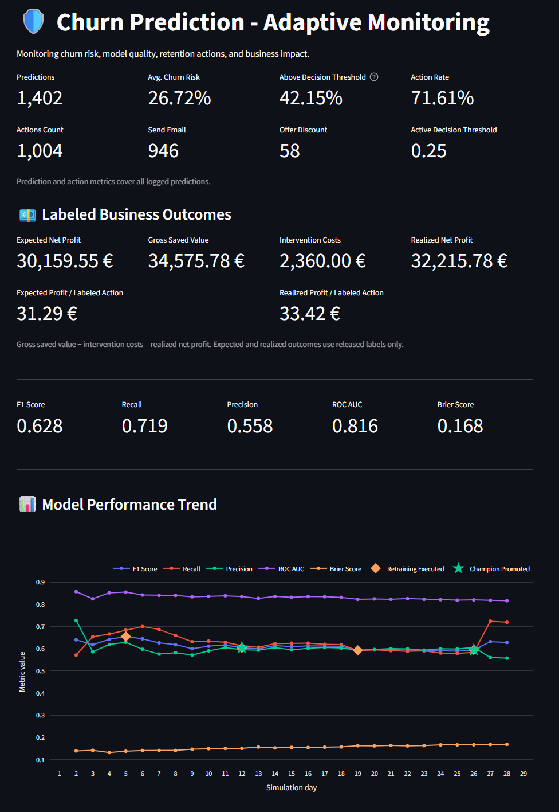
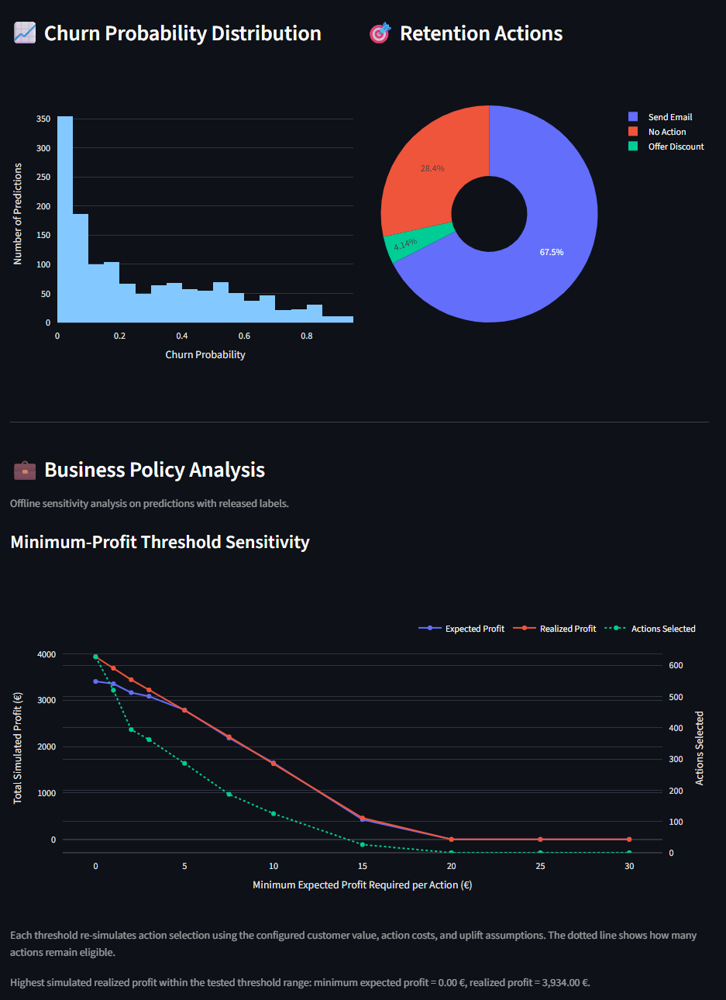

# Monitoring, SLOs and Alerting

## Purpose

The platform monitors three kinds of production risk:

1. operational reliability of the prediction API;
2. statistical quality of the classifier after delayed labels arrive;
3. business quality of the resulting retention decisions.

A fast API can serve a poor model, and a statistically strong model can still
produce uneconomic actions. All three perspectives are therefore required.

## Terminology

- **SLI — Service Level Indicator:** a measured signal such as availability or
  p95 latency.
- **SLO — Service Level Objective:** the desired value for an SLI.
- **Alert:** a condition indicating that an objective is at risk or violated.

SLOs are internal engineering objectives, not contractual guarantees.

## Operational Metrics

FastAPI exposes Prometheus metrics at `/metrics`.

| Signal | Purpose |
|---|---|
| `api_serving_ready` | Whether a complete serving bundle is active |
| `api_request_count_total` | Request volume by path |
| `api_response_status_total` | HTTP behavior by path and status code |
| `api_request_latency_seconds` | Request-duration histogram |
| Prediction traffic | Requests per minute |

Deployment probe requests use a dedicated context marker and should not
contaminate normal prediction-history-based ML monitoring.

## Service Objectives

| Objective | Indicator | Current alert intent |
|---|---|---|
| API availability | `up{job="churn-api"}` | API remains scrapeable |
| Serving readiness | `api_serving_ready` | A complete bundle remains active |
| Prediction reliability | `/predict` 5xx ratio | Server-error rate stays below 1% with sufficient traffic |
| Prediction latency | `/predict` p95 | p95 stays below one second with sufficient traffic |

Client-side 4xx responses are not server failures and are excluded from the 5xx
SLO.

## Alert Rules

The current rules are:

- `ChurnAPIUnavailable`;
- `ChurnServingBundleNotReady`;
- `ChurnPredictionServerErrorRateHigh`;
- `ChurnPredictionLatencyHigh`.

The `for` durations avoid paging on a single scrape failure or a brief startup
transition.

Validate the rules:

```bash
docker run --rm \
  --entrypoint promtool \
  -v "$PWD/monitoring:/etc/prometheus:ro" \
  prom/prometheus:latest \
  check rules /etc/prometheus/alerts.yml
```

Inspect the rules loaded by Prometheus:

```bash
curl -s http://localhost:9090/api/v1/rules \
  | jq '.data.groups[].rules[] | {name, state, health}'
```

## Alertmanager

Alertmanager groups, deduplicates and routes alerts. The local receiver accepts
Alertmanager webhooks and optionally forwards them to Slack.

Validate configuration:

```bash
docker compose run --rm \
  --no-deps \
  --entrypoint /bin/amtool \
  alertmanager \
  check-config /etc/alertmanager/alertmanager.yml
```

Check readiness and routing:

```bash
curl -fsS http://localhost:9093/-/ready
curl -s http://localhost:9090/api/v1/alertmanagers | jq .
```

When `SLACK_WEBHOOK_URL` is empty, the receiver logs that external delivery was
skipped. This is expected and does not indicate failure between Prometheus,
Alertmanager and the receiver.

## Grafana SLO Dashboard

The provisioned dashboard presents:

- serving readiness;
- prediction availability;
- p95 prediction latency;
- request traffic;
- prediction 5xx rate;
- p50, p95 and p99 latency.

`No data` does not automatically mean failure. Rate and histogram expressions
need matching counters and enough observations in the selected lookback window.

<p align="center">
  
</p>

## ML Quality Monitoring

### Runtime data quality

Each prediction batch records:

- row count;
- missing rates by input field;
- unseen categories;
- overall quality status;
- validation failures where applicable.

### Feature drift

Selected production inputs are compared with reference distributions. Drift
must persist across configured windows before it contributes to retraining.

### Delayed-label performance

Churn outcomes arrive after predictions have already been served. Once labels
are released and joined to prediction history, the platform computes rolling
classification metrics such as:

- F1 score;
- recall;
- ROC AUC;
- Brier score;
- sample count and class balance.

An undefined metric caused by a one-class window is recorded as insufficient
evidence rather than silently treated as model degradation.

### Business monitoring

The Streamlit dashboard adds:

- churn-risk distribution;
- action distribution;
- customer value;
- expected retention value;
- campaign budget use;
- retraining and promotion events.

## Dashboard Roles

| Dashboard | Primary purpose |
|---|---|
| Grafana | Live API reliability and SLO status |
| Streamlit | Model quality, delayed labels and business decisions |

<p align="center">
  
</p>

<p align="center">
  
</p>

## Verification Commands

```bash
curl -fsS http://localhost:8000/readyz | jq .

curl -fsS http://localhost:8000/metrics \
  | grep -A2 api_serving_ready

curl -sG \
  --data-urlencode 'query=api_serving_ready' \
  http://localhost:9090/api/v1/query \
  | jq .
```

## Initial Incident Response

| Alert | First checks |
|---|---|
| API unavailable | Container/Cloud Run state, `/livez`, application logs |
| Bundle not ready | `/readyz`, release pointer, checksums, MLflow/GCS access |
| High 5xx rate | Request samples, prediction exceptions, active release |
| High latency | Traffic, batch size, p95/p99 trend, CPU/memory and timing stages |

If an incident begins immediately after release activation, compare the current
release ID with the previous release and use the tested rollback procedure.

## Related Documentation

- [Architecture](architecture.md)
- [Serving releases](serving-releases.md)
- [Retraining policy](retraining-policy.md)
- [Operations runbook](operations-runbook.md)

